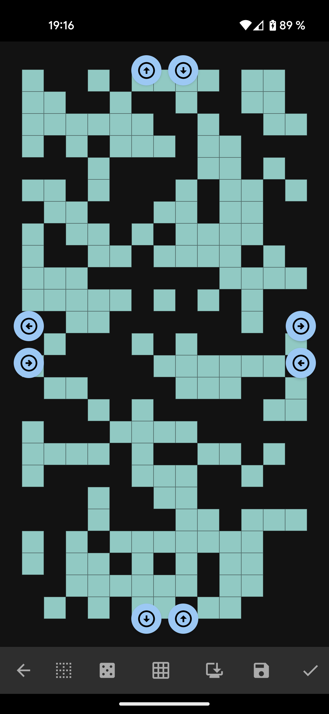
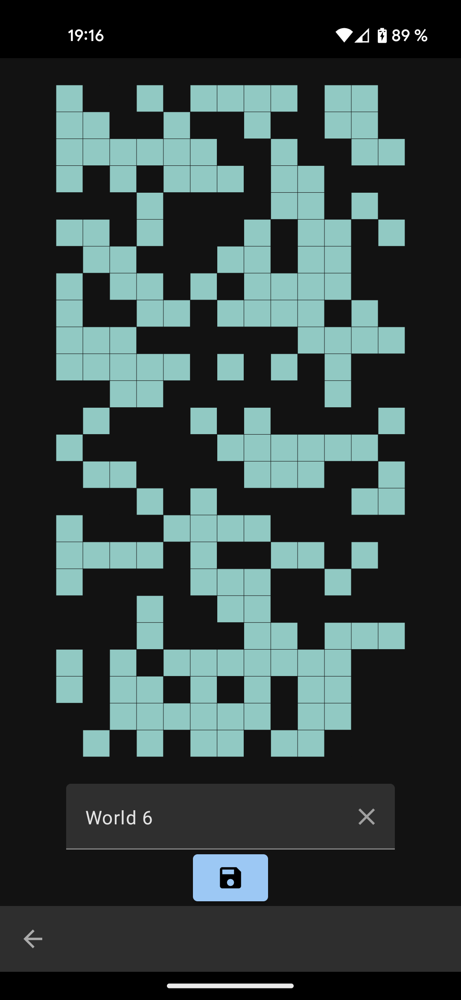
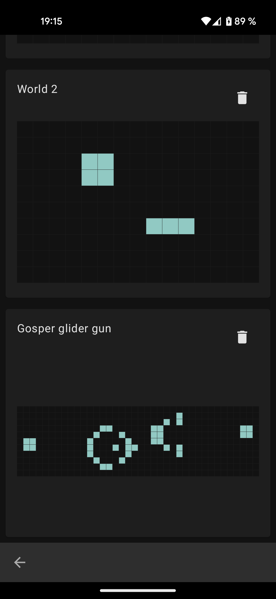
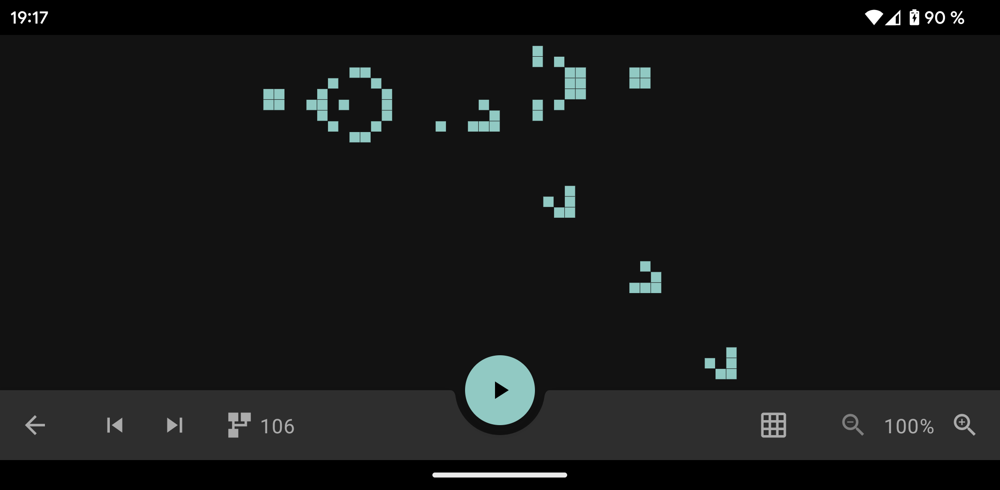
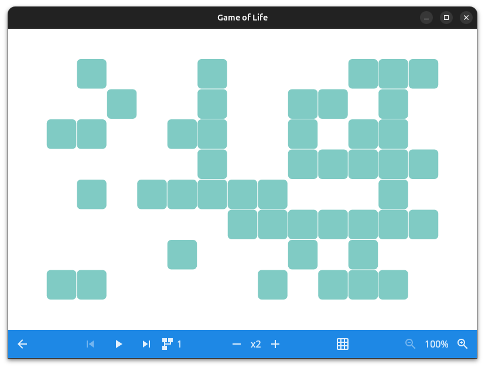
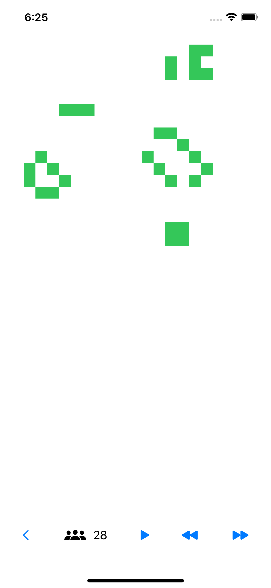
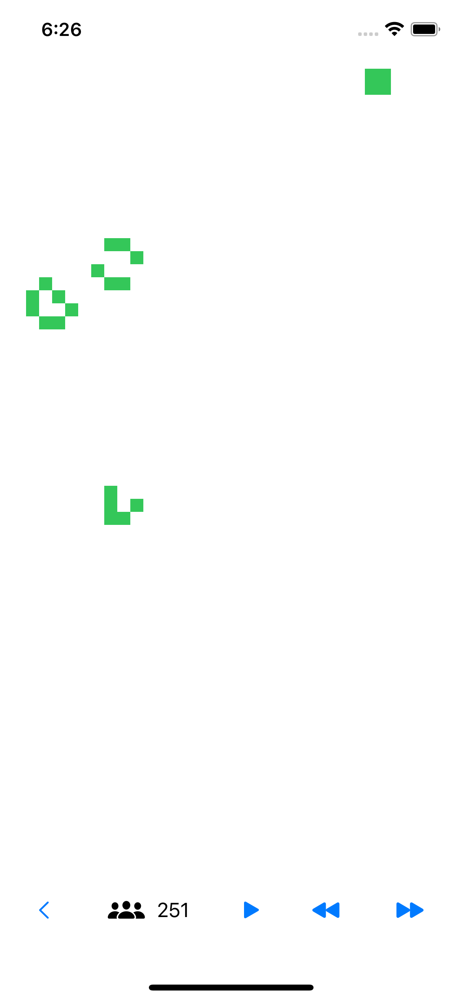

# GameOfLife

Pet project to experiment with Kotlin Multiplatform

## Description

The business logic is wrote in Kotlin and shared across all targets.

The UI for Android and Desktop/JVM use Jetbrains Compose.

The UI for iPhone is written using SwiftUI.

## Screenshots

### Android

    
     
     

     

### Desktop

     

### iPhone

    
     

## Todo

- Save/Load only sub-areas of the game world to make reusable patterns
- Add pre-made interesting patterns
- Cells of different colors
- Dynamically alterable game rules
- Improve the ergonomics of the UI
- Add decorations to the screenshots (device frame, captions..)
- Android EdgeToEdge
- Android pinch zoom on location
